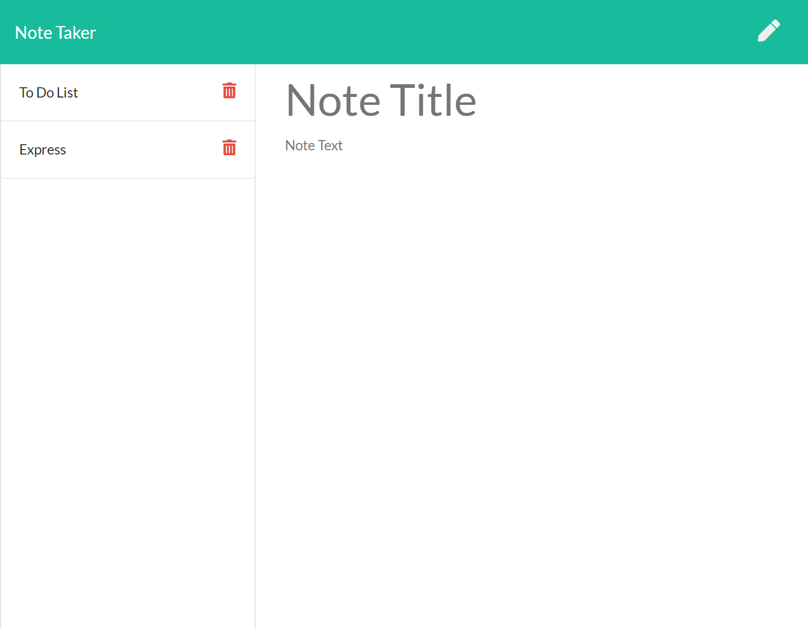

# Note Taker Application

## Description
Store all of your notes using this note taker application. You can see all of your saved notes in the left-hand side of the screen and have the ability to delete them. Each note in stored on a server using a post request and retrieved using a get request.   

## Table of Contents

 - [Installation](#installation)
 - [Features](#features)
 - [Link to Deploy](#link-to-deploy)
 - [Screenshot](#screenshot)
 - [License](#license)
 - [Questions](#questions)
 
## Installation
To use the note taker application, you must install Node.js and the Express and Generate Unique Id npm packages. 

## Features

This project features:

 - Javascript and Node.js
 - Express npm package
 - Generate Unique Id npm package
 - Use of server to store persistent data
 - Ability to create and delete content generated by the user
 - Use of get and post requests

## Link to Deploy
[Note Taker Application](https://ldahlin-notetaker.herokuapp.com/)

## Screenshot

## License
Copyright <2021> <COPYRIGHT Leigh C Dahlin>

Permission is hereby granted, free of charge, to any person obtaining a copy of this software and associated documentation files (the "Software"), to deal in the Software without restriction, including without limitation the rights to use, copy, modify, merge, publish, distribute, sublicense, and/or sell copies of the Software, and to permit persons to whom the Software is furnished to do so, subject to the following conditions:

The above copyright notice and this permission notice shall be included in all copies or substantial portions of the Software.

THE SOFTWARE IS PROVIDED "AS IS", WITHOUT WARRANTY OF ANY KIND, EXPRESS OR IMPLIED, INCLUDING BUT NOT LIMITED TO THE WARRANTIES OF MERCHANTABILITY, FITNESS FOR A PARTICULAR PURPOSE AND NONINFRINGEMENT. IN NO EVENT SHALL THE AUTHORS OR COPYRIGHT HOLDERS BE LIABLE FOR ANY CLAIM, DAMAGES OR OTHER LIABILITY, WHETHER IN AN ACTION OF CONTRACT, TORT OR OTHERWISE, ARISING FROM, OUT OF OR IN CONNECTION WITH THE SOFTWARE OR THE USE OR OTHER DEALINGS IN THE SOFTWARE.

## Questions
If you have any questions, please use the contact information below:
https://github.com/leighdahlin  
leigh.dahlin@gmail.com